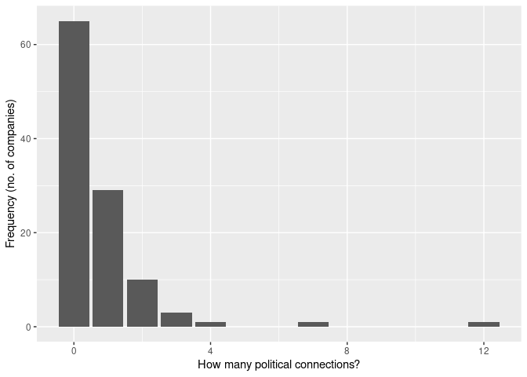

## Introduction

Suppose you want have retrieved the ISIN-numbers of a number of companies on which you want to do research. How do you look for those specific companies in Bureau van Dijk/Orbis?

You effectuate a search with:
  - Identifiers
  - Stock and securities number
    - You paste the ISIN numbers in there
    
How do you look for those specific companies in WRDS?
    
### Example

Here is the Excel file on the basis of which you want to retrieve the data (note that I clean the Excel file to make it nicely visible in R): 


```r
library(readxl); library(tidyverse)

data <- readxl::read_xls("HDAX_ICR.20140131.xls", 
                 sheet = 2) %>%
  janitor::remove_empty() %>%
  janitor::row_to_names(1) %>%
  select(1:7) 

data %>%
  head()
```

```
## # A tibble: 6 x 7
##   `Index Trading … `Index Name` `Index ISIN` `Trading Symbol` Instrument ISIN 
##   <chr>            <chr>        <chr>        <chr>            <chr>      <chr>
## 1 HKDX             HDAX KURSIN… DE0008469974 SPR              A.SPRINGE… DE00…
## 2 HKDX             HDAX KURSIN… DE0008469974 ARL              AAREAL BA… DE00…
## 3 HKDX             HDAX KURSIN… DE0008469974 ADS              ADIDAS AG… DE00…
## 4 HKDX             HDAX KURSIN… DE0008469974 ADV              ADVA OPT.… DE00…
## 5 HKDX             HDAX KURSIN… DE0008469974 AIR              AIRBUS GR… NL00…
## 6 HKDX             HDAX KURSIN… DE0008469974 AIXA             AIXTRON S… DE00…
## # … with 1 more variable: Country <chr>
```

```r
data <- data %>%
  janitor::clean_names() %>%
  select(trading_symbol, instrument, isin) %>%
  distinct()
```

Then, I take the ISIN numbers (in the ISIN column) and go to Bureau van Dijk/Orbis and search for:

- Identifiers
  - Stock and securities number
  - Paste all the ISIN numbers in there
  - Alternatively, you can write the ISIN column to a text file and upload the text file to Orbis:
  

```r
data %>%
  janitor::clean_names() %>%
  select(isin) %>%
  write_delim("isin_nos.txt",
              col_names = FALSE)
```

Note that the argument `col_names = FALSE` has to be included, because databases will not take the first line into account as a column name, but rather, as something to be looked for. It will therefore produce an error if you include it. 

- Orbis will then let you know how many of the ISIN's have been found, and how many haven't been found. 

After having looked up the _companies_ you want to find, you can look up the _variables_. To proceed to that stage, click **View results**. Then, suppose you want to look for the total assets of these companies, as well as for the names of the directors. 

You go to: 

  - Add/Remove Columns
  - Identifiers
  - Add ISIN, Tickers (So that you can find data on these companies in _every_ database, not only BvD/Orbis)

Then, go to:
  - Directors & Managers
  - Other personal information
  - Select Name & Last Name
  - Possibly (but not done here), you can select Date of Installment, Date of Resignation

Then, export the file to .xlsx (or any other extension you like). We can import these data in R now. It is important to run `tidyr::fill()` to fill the rows with their preceding values to do some data cleaning and aggregation later on. `fill()` takes on as arguments the columns that you want to apply this operation on. 


```r
directors <- read_xlsx("directors.xlsx") %>%
  janitor::clean_names() %>%
  select(-1) %>%
  tidyr::fill(c(1:6))
```

```
## New names:
## * `` -> ...1
```

```r
directors %>%
  head()
```

```
## # A tibble: 6 x 6
##   company_name  bvd_no       ticker isin         first_name last_name
##   <chr>         <chr>        <chr>  <chr>        <chr>      <chr>    
## 1 VOLKSWAGEN AG DE2070000543 VOW    DE0007664005 Andreas    Renschler
## 2 VOLKSWAGEN AG DE2070000543 VOW    DE0007664005 Andreas    Renschler
## 3 VOLKSWAGEN AG DE2070000543 VOW    DE0007664005 Andreas    Renschler
## 4 VOLKSWAGEN AG DE2070000543 VOW    DE0007664005 Andreas    Renschler
## 5 VOLKSWAGEN AG DE2070000543 VOW    DE0007664005 Hans       Poetsch  
## 6 VOLKSWAGEN AG DE2070000543 VOW    DE0007664005 Hans       Poetsch
```

Now, let's find some information about Bundestag members from Wikipedia:


```r
library(rvest)

bundestag <- read_html("https://en.wikipedia.org/wiki/List_of_members_of_the_17th_Bundestag") %>%
  html_nodes("table.wikitable:nth-child(8)") %>%
  html_table(fill = TRUE) %>%
  purrr::reduce(as.data.frame)


bundestag %>%
  head()
```

```
##                 Land                   Name Party
## 1 Schleswig-Holstein      Börnsen, Wolfgang   CDU
## 2 Schleswig-Holstein       Liebing, Ingbert   CDU
## 3 Schleswig-Holstein       Koschorrek, Rolf   CDU
## 4 Schleswig-Holstein Wadephul, Johann David   CDU
## 5 Schleswig-Holstein       Murmann, Philipp   CDU
## 6 Schleswig-Holstein          Schröder, Ole   CDU
##                             district          list notes
## 1 district 001 Flensburg – Schleswig list (no. 04)  <NA>
## 2                       district 002 list (no. 07)  <NA>
## 3                       district 003 list (no. 08)  <NA>
## 4                       district 004 list (no. 01)  <NA>
## 5                       district 006 list (no. 10)  <NA>
## 6                       district 007 list (no. 02)  <NA>
```

Nice, but let's select only the names, and let's put it in the right order:


```r
bundestag <- bundestag %>%
  janitor::clean_names() %>%
  select(name) %>%
  separate(name, into = c("last", "first"), sep = ",") %>%
  mutate(first_last = paste(first, last)) %>%
  select(first_last)
```

```
## Warning: Expected 2 pieces. Missing pieces filled with `NA` in 1 rows [271].
```

```r
bundestag %>%
  head()
```

```
##               first_last
## 1       Wolfgang Börnsen
## 2        Ingbert Liebing
## 3        Rolf Koschorrek
## 4  Johann David Wadephul
## 5        Philipp Murmann
## 6           Ole Schröder
```


Let us now count matches between `directors` and `bundestag`:


```r
library(stringdist)

directors <- directors %>%
  mutate(first_last = paste(first_name, last_name)) 
```

First, I paste the first and last name of the directors, so as to match with the first and last names of the Bundestag members, which I put into the same format.

Secondly, I use the `amatch` function from the stringdist package to find whether the name of the director matches the name of a bundestag member. Then, I apply the `if_else` function on the outcome of that calculation. If the outcome of the calculation (which gives me a number, the position of the match in the `bundestag` data.farme) is different from 0, then, count it as a match ("yes"). Otherwise, no match ("no"). 


```r
directors <- directors %>%
  mutate(inpolitics = if_else(stringdist::amatch(first_last, bundestag$first_last, maxDist = 3) != 0,
                         "yes", 
                         "no")
  )
                         

directors %>%
  arrange(inpolitics)
```

```
## # A tibble: 13,113 x 8
##    company_name  bvd_no  ticker isin  first_name last_name first_last inpolitics
##    <chr>         <chr>   <chr>  <chr> <chr>      <chr>     <chr>      <chr>     
##  1 VOLKSWAGEN AG DE2070… VOW    DE00… Christian  Schmidt   Christian… yes       
##  2 DAIMLER AG    DE7330… DAI    DE00… Oliver     Fischer   Oliver Fi… yes       
##  3 DAIMLER AG    DE7330… DAI    DE00… Michael    Friess    Michael F… yes       
##  4 DAIMLER AG    DE7330… DAI    DE00… Michael    Fuchs     Michael F… yes       
##  5 DAIMLER AG    DE7330… DAI    DE00… Kerstin    Neumann   Kerstin N… yes       
##  6 DAIMLER AG    DE7330… DAI    DE00… Eckhart    von Klae… Eckhart v… yes       
##  7 DAIMLER AG    DE7330… DAI    DE00… Eckhart    von Klae… Eckhart v… yes       
##  8 DAIMLER AG    DE7330… DAI    DE00… Eckard     von Klae… Eckard vo… yes       
##  9 DAIMLER AG    DE7330… DAI    DE00… Andrea     Jung      Andrea Ju… yes       
## 10 DAIMLER AG    DE7330… DAI    DE00… Bernhard   Walter    Bernhard … yes       
## # … with 13,103 more rows
```

Now, finally, let's merge this dataset on political connections with the data on companies, `data`, on the basis of ISIN. I understand this looks difficult, but what I am doing is this:

1. I group the directors data frame according to ISIN. Now the data.frame consist of virtual 'mini data.frames', each one for each ISIN number. Then, I only select a certain name _once_ per company. Then, I want them to summarize the amount of occurrences of "yes' in the inpolitics variable, i.e., the matches! Then, finally, the `summarize` function makes sure I get the group-variable back. 


```r
no_of_pol_con_per_firm <- directors %>%
  group_by(isin) %>%
  distinct(first_last, .keep_all = TRUE) %>%
  summarize(howmany = sum(inpolitics == "yes",
                          na.rm = TRUE)
            )

no_of_pol_con_per_firm %>%
  ungroup() %>%
  arrange(desc(howmany))
```

```
## # A tibble: 110 x 2
##    isin         howmany
##    <chr>          <int>
##  1 DE0007100000      12
##  2 DE000BAY0017       7
##  3 DE000BASF111       4
##  4 DE0005557508       3
##  5 DE0006047004       3
##  6 DE000LED4000       3
##  7 DE0005437305       2
##  8 DE0005439004       2
##  9 DE0005552004       2
## 10 DE0005773303       2
## # … with 100 more rows
```

Now, we can merge this with `data`, the data.frame we started with:


```r
merged_data <- left_join(data, no_of_pol_con_per_firm, 
          by = c("isin" = "isin"))


head(merged_data) 
```

```
## # A tibble: 6 x 4
##   trading_symbol instrument                isin         howmany
##   <chr>          <chr>                     <chr>          <int>
## 1 SPR            A.SPRINGER SE VNA         DE0005501357       0
## 2 ARL            AAREAL BANK AG            DE0005408116       1
## 3 ADS            ADIDAS AG NA O.N.         DE000A1EWWW0       0
## 4 ADV            ADVA OPT.NETW.SE  O.N.    DE0005103006       0
## 5 AIR            AIRBUS GRP (LEGALLY EADS) NL0000235190       0
## 6 AIXA           AIXTRON SE NA O.N.        DE000A0WMPJ6       0
```
  
  
And we can chose to further clean it, because the ISIN's change over time: 


```r
final_data <- merged_data %>%
  group_by(instrument) %>%
  summarize(howmany = sum(howmany, na.rm = TRUE))
```

A quick visualization:


```r
final_data %>%
  ggplot(aes(x = howmany)) + geom_bar() + 
  xlab("How many political connections?") +
  ylab("Frequency (no. of companies)")
```

<!-- -->

### Additional information in WRDS

Remember, that in data:


```r
head(data)
```

```
## # A tibble: 6 x 3
##   trading_symbol instrument                isin        
##   <chr>          <chr>                     <chr>       
## 1 SPR            A.SPRINGER SE VNA         DE0005501357
## 2 ARL            AAREAL BANK AG            DE0005408116
## 3 ADS            ADIDAS AG NA O.N.         DE000A1EWWW0
## 4 ADV            ADVA OPT.NETW.SE  O.N.    DE0005103006
## 5 AIR            AIRBUS GRP (LEGALLY EADS) NL0000235190
## 6 AIXA           AIXTRON SE NA O.N.        DE000A0WMPJ6
```

We also have Isin's, and tickers. We can use that information to find more data about these companies on WRDS if we want to!

## Conclusion

This file showed how to find political connections in a sample of German companies. More nuanced analyses would take into account also the dynamic nature of political connections, and beware of very common names. 

